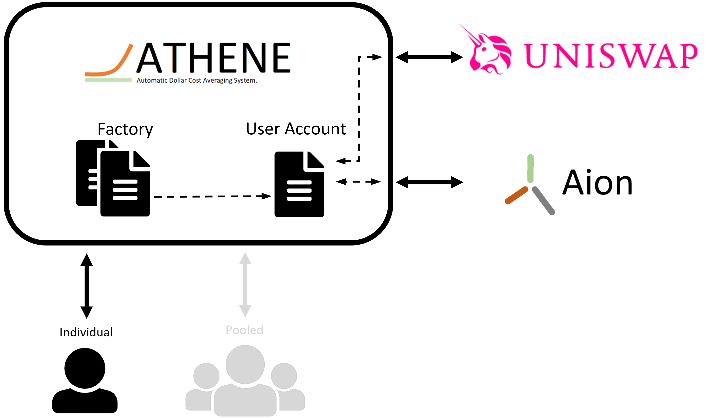

# Athene: Authomatic Dollar Cost Averaging.
Dollar-cost averaging (DCA) is an investment strategy in which an investor divides up the total amount to be invested across periodic purchases of a target asset in an effort to reduce the impact of volatility on the overall purchase. The purchases occur regardless of the asset's price and at regular intervals; in effect, this strategy removes much of the detailed work of attempting to time the market in order to make purchases of equities at the best prices.[source]

Development of onchain Automatic Marker Makers (AMM) such as Uniswap, Curve, etc., generates a valuable oportunity for using DCA as an investment strategy on-chain. Unfortunatly, this requires manually executing transactions periodically given that the Ethereum Network does not support natively scheduling transactions. Furthermore, the high gas prices have become a barrier for small investors as sending periodical transactions could be prohibitely expensive.

Athenea solves this problems by integrating Aion Scheduling system with a set gas-efficient smart contracts. Athenea allows automatic execution of periodical purchases of a particular token in Uniswap. Furthermore, it allows users to get together and create voults, such that the gas needed to execute transactions is shared amoung participants, reducing significantly the cost associated with broadcasting transactions in the ethereum network. Athenea code is open sourced, the system is completelly trustless and users retain control of their assets at all times.

# How it works:

In order to make use of the system, users create an Athene DCA account using teh Athena DCA web app. This account is an smart contract that contains all the necessary code to make calls to Uniswap and interfaces with Aion Scheduling system. The same account can be used to manage several DCA subscriptions (recurrent purchases of a particular token in Uniswap). Athena DCA web app provides a easy an intuitive user interface to manage their accounts, providing access to deposits, withdrawal of purchased tokens, start and stop DCA subscriptions, and provide statistical data about each subscription. Users simply select the token used to make the purchase, the token to purchase, and the time interval between pruchases (minutes, hours or days).quities at the best prices.

# Fees
The cost incurred while using Athene DCA can be devided in three parts:

* Transaction cost: this is the product of the gas consumed by the transaction and the gas price.
* Automatic schuduling fee: This is the fee required by Aion which is fixed (currently this fee is 0.000132 ETH per transaction).
* Athene Fee: This fee is set to 0.04% of the total amount to purchase in each transaction.

For instance, if you create a DCA for buying 100 DAI worth of Ether the fee Athena fee is 0.04 DAI.

# Pooled DCA
Pooled DCA in Athene will allow to use the power of the community, reducing significantly the costs (a single transaction for all the participants plus a single Aion fee for all the participants). This solution is still on development.

# Status
Athene DCA is available for testing on the Kovan testNet, visit [ETHPantheon web site](https://athene.ethpantheon.com)

